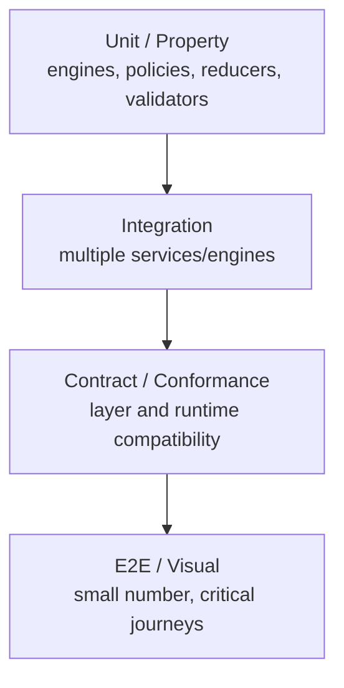
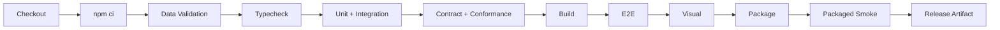

# Agon Build, Test & Deploy Guide

**Status:** STABLE engineering guide  
**Current implementation baseline:** TypeScript/React/Vite + Electron desktop, Vitest, Playwright; Windows NSIS packaging.

This guide documents the repository as it exists today and the quality gates expected as the foundation architecture is implemented.

## 1. Prerequisites

Required:
- Git
- a Node.js/npm version compatible with the repository lockfile and dependencies
- Windows for the current supported NSIS packaging path
- PowerShell for the current visual-test command

Recommended:
- clean clone/worktree for release verification;
- sufficient disk space for Electron/Playwright dependencies and packaged artifacts.

Use `package-lock.json` as the dependency lock. Prefer `npm ci` for reproducible clean installs.

## 2. Clone and install

```bash
git clone <repository-url>
cd bible-challenge
npm ci
```

The repository currently uses an npm workspace for `admin`.

## 3. Development commands

### Type checking

```bash
npm run typecheck
npm run typecheck:admin
```

TypeScript is configured in strict mode and targets ES2022.

### Data validation

```bash
npm run check:data
```

Run this when changing game/content data and as part of normal pre-merge validation.

### Unit/component tests

```bash
npm run test:run
npm run test:admin
```

Interactive Vitest is available through:

```bash
npm test
```

### Build

```bash
npm run build
npm run build:admin
```

The main build performs data validation and TypeScript checking before Vite build.

### Run installed-app development baseline

```bash
npm start
```

Current `start` builds the main application and launches Electron; it is not a hot-reload command.

## 4. End-to-end testing

Full E2E command:

```bash
npm run test:e2e
```

This builds main/admin and then invokes the Playwright smoke runner.

When the required build outputs are already current:

```bash
npm run test:e2e:fast
```

Do not use the fast/no-build path as release evidence unless the exact build under test is known.

## 5. Visual regression testing

```powershell
npm run test:visual
```

Update baselines only when the visual change is intentional and reviewed:

```powershell
npm run test:visual:update
```

A changed snapshot is not automatically a correct snapshot. Review Host, Stage and Controller implications, responsive behavior, and accessibility before accepting it.

## 6. Full local quality gate

```bash
npm run test:all
```

Current `test:all` runs data validation, main/admin type checking, main/admin tests, E2E and visual regression.

Before merging architecture/reference-game work, also require the relevant contract/conformance tests introduced by the foundation issues even if they are not yet wired into `test:all`.

## 7. Test pyramid and ownership



### Unit/property tests
Use for deterministic engines, answer policies, scoring rules, fairness calculations, schema validators and reducers. Inject clock/RNG; do not sleep/wait on real time when a deterministic clock can be used.

### Integration tests
Use for SessionRuntime + GameRuntime + ledger/persistence/projection interactions.

### Contract tests
Every stable contract gets boundary tests. Serialized contracts keep versioned fixtures.

### Conformance tests
All runtime adapters (Local, Shared, Hosted) must satisfy the same semantic suite where capabilities overlap. Display endpoints and input adapters should likewise have common suites.

### E2E
Cover representative user journeys rather than every rule permutation.

### Visual
Cover stable presentation surfaces/layouts. Game-rule correctness belongs below visual tests.

## 8. Required architecture/security tests

As foundations land, CI/local gates should include:
- projection hidden-state leak tests;
- command authorization/idempotency/replay tests;
- deterministic clock/RNG tests;
- persistence save/resume/migration fixtures;
- score ledger correction/reversal tests;
- answer-evaluation policy tests;
- package integrity/path traversal tests;
- network fairness simulations (latency/jitter/clock manipulation);
- reconnect/resynchronization tests;
- accessibility interaction/readiness tests;
- compatibility/conformance matrix generation;
- archive import/export round-trip and secret-exclusion tests.

## 9. Packaging

Current Windows installer command:

```bash
npm run package
```

Current packaging uses `electron-builder`, Windows x64 NSIS, output directory `release`, and installer naming based on `BibleChallenge-Setup-${version}`.

Packaging is not deployment approval. A release candidate must pass the release gates below.

## 10. Release/deployment model

### Local desktop
The current deployable artifact is the Windows installer. Until update architecture is implemented, release is an explicit artifact distribution process.

### Shared
Future Shared deployment consists of compatible installed Agon sites plus the selected realtime/coordinator infrastructure. Game code must not be forked for Shared. Production Shared deployment requires security, identity/admission, transport, fairness, observability and compatibility gates.

### Hosted
Future Hosted deployment consists of the hosted authority/services and browser clients implementing the same contracts. Infrastructure/provider specifics belong in a deployment runbook when chosen; they are intentionally not invented here.

## 11. Release gates

Before producing a stable release:
1. clean `npm ci` succeeds;
2. `npm run test:all` succeeds;
3. new/changed contracts pass contract/conformance tests;
4. data/content validation succeeds;
5. package/installer succeeds on supported target;
6. smoke test the packaged artifact, not only Vite output;
7. schema migrations are tested against representative previous-version data;
8. active/saved session compatibility is understood;
9. security/privacy review is completed for new external inputs/data classes;
10. release notes identify migrations, compatibility constraints and known limitations.

For Shared/Hosted additionally require:
- protocol/version negotiation tests;
- TLS/credential/admission configuration verification;
- rate-limit and abuse controls;
- observability/alerting readiness;
- dependency/degraded-mode tests;
- rollback plan;
- backup/restore verification for authoritative persistence.

## 12. CI pipeline target



PR CI may stop before packaging for ordinary changes, but release CI should verify the actual distributable artifact.

## 13. Branch/PR expectations

A development PR should state:
- problem/requirement;
- architectural contracts touched;
- implementation summary;
- tests added/changed;
- data/schema migration impact;
- security/privacy impact;
- screenshots for material UI changes;
- compatibility impact for Local/Shared/Hosted;
- follow-up issues if scope is intentionally deferred.

Breaking contract changes require an ADR and version/migration plan.

## 14. Schema and persistence migrations

Never mutate historical persisted data assumptions without a versioned migration. Migration tests should cover:
- previous supported schema -> current;
- idempotent/retry behavior where applicable;
- failed migration rollback/recovery;
- unknown future version rejection;
- saved Event/tournament/session restoration.

## 15. Content changes

Published content is revisioned. Correcting a published question should normally create a new revision rather than rewriting history needed by saved/replayable sessions. Generated drafts must pass the configured review lifecycle before publication.

## 16. Debugging guidance

Prefer structured domain/session IDs and reason codes over dumping state. Never log credentials, join secrets, private hands or unrevealed answers as routine diagnostics. When deterministic replay is available, capture privacy-safe event/snapshot/RNG/clock metadata sufficient to reproduce the problem.

## 17. Definition of done for a feature/game

A feature/game is not done merely when it works in the current UI. Applicable completion includes:
- uses official contracts instead of bypassing layers;
- no direct outcome-affecting wall-clock/RNG usage;
- content/schema validated;
- tests at the lowest useful layer;
- persistence/reconnect behavior defined if stateful;
- projections do not leak hidden state;
- accessibility/input requirements declared;
- Local/Shared/Hosted capability expectations declared;
- required assets/packages identified;
- documentation updated when behavior/contracts change.

## 18. Current-command source of truth

`package.json` remains the executable source of truth for npm scripts. If a command in this guide becomes stale, update this guide in the same PR that changes the script.