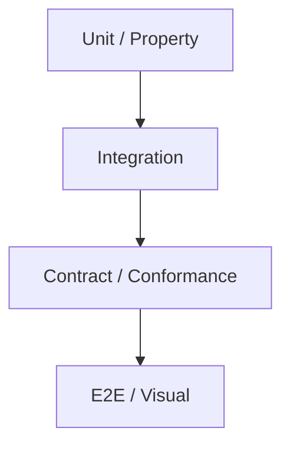
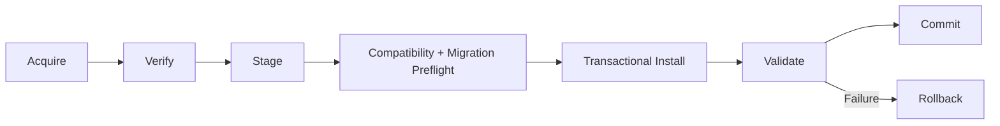

# Agon Build, Test & Deploy Guide

> **Status: design reference (merged 2026-09-28).** Implementation targets **Agon vNext** per [ADR-001](../architecture/adr-001-agon-vnext-staged-replacement.md) and [the vNext migration spec](../../specs/agon-vnext-migration-spec.md). Any integration through legacy `src/lib/gameEngine.ts`, `src/renderer/App.tsx`, per-game `PlayerStats` fields or the central `GameId` union described here is superseded. Sequencing is governed by `ROADMAP.md` and native GitHub issue dependencies. Where this document conflicts with ADR-001, **ADR-001 prevails**.

**Status:** STABLE engineering guide  
**Current implementation baseline:** TypeScript/React/Vite + Electron desktop, Vitest, Playwright; Windows NSIS packaging.

This guide documents the repository as it exists today and the quality gates expected as the foundation architecture is implemented. The target installation/package/update model is defined by `specs/architecture/packaging-installation-entitlements.md` (PR #424).

## 1. Prerequisites

Required:
- Git
- a Node.js/npm version compatible with the repository lockfile and dependencies
- Windows for the current supported NSIS packaging path
- PowerShell for the current visual-test command

Recommended:
- clean clone/worktree for release verification;
- sufficient disk space for Electron/Playwright dependencies and packaged artifacts.

Use `package-lock.json` as the dependency lock. Prefer `npm ci` for reproducible clean installs.

## 2. Clone and install

```bash
git clone <repository-url>
cd bible-challenge
npm ci
```

The repository currently uses an npm workspace for `admin`.

## 3. Development commands

### Type checking
```bash
npm run typecheck
npm run typecheck:admin
```

### Data validation
```bash
npm run check:data
```

### Unit/component tests
```bash
npm run test:run
npm run test:admin
```

### Build
```bash
npm run build
npm run build:admin
```

### Run installed-app development baseline
```bash
npm start
```

## 4. End-to-end testing

```bash
npm run test:e2e
```

When required outputs are already current:
```bash
npm run test:e2e:fast
```

Do not use the fast/no-build path as release evidence unless the exact build under test is known.

## 5. Visual regression testing

```powershell
npm run test:visual
```

Update baselines only for intentional reviewed changes:
```powershell
npm run test:visual:update
```

## 6. Full local quality gate

```bash
npm run test:all
```

Before merging foundation/reference-game work, also require applicable contract/conformance tests even when not yet wired into `test:all`.

## 7. Test pyramid and ownership


```mermaid
flowchart TB
  E2E[E2E / Visual]
  CON[Contract / Conformance]
  INT[Integration]
  UNIT[Unit / Property]
  UNIT --> INT --> CON --> E2E
```

Use unit/property tests for deterministic engines/policies/validators, integration for service boundaries, contract tests for STABLE serialized/API contracts, conformance across runtime adapters, E2E for critical journeys and visual tests for presentation.

## 8. Required architecture/security tests

As foundations land, CI/local gates include projection leak tests; authorization/idempotency; deterministic clock/RNG; persistence migration/resume; score corrections; answer policies; network fairness; reconnect; accessibility; compatibility; archive round-trip; and package/entitlement tests described below.

## 9. Desktop installer

Current command:
```bash
npm run package
```

Current packaging uses `electron-builder`, Windows x64 NSIS and `release` output. The target installer evolves to one signed distribution capable of installing:
- Agon Core/runtime;
- Agon Play/Host;
- Agon Admin;
- Package Manager and entitlement verifier;
- core documentation/assets;
- selected bundled `.agonpack` packages, including included and installed-but-locked packs.

Bundled packages must be registered/validated through PackageManager rather than copied into game-specific filesystem locations.

Program files and user data are separate. Ordinary uninstall must not silently delete irreplaceable saved Events/sessions or user-authored content.

## 10. Building `.agonpack` packages

Package tooling must produce a versioned manifest, deterministic payload inventory, integrity hashes/signature metadata, dependencies, compatibility, entitlement/licensing metadata and documentation/asset references. Normal packages are declarative/non-executable.

Package types include `GAME`, `CONTENT`, `BIBLE_TRANSLATION`, `MEDIA_ASSET`, `DOCUMENTATION`, and `BUNDLE`.

Before publication validate schema, IDs/versions, dependency graph, Agon compatibility, provenance/license, entitlement policy, documentation, assets/content revisions, update/migration behavior and offline/Shared policies.

See `guides/package-development.md`.

## 11. Package signing and entitlement signing

Package/application integrity signing and entitlement-certificate signing are separate trust purposes. Release automation may use separate protected signing identities/keys. Private signing keys must never be committed to the repository, included in installers/packages, or exposed in CI logs/artifacts.

The application contains only the trusted public material required for verification.

## 12. Release/deployment model

### Local desktop
Stable release artifact is the installer plus independently publishable compatible `.agonpack` packages. A normal installer may bundle popular/free/locked packs; future Complete/Offline distribution may bundle all redistributable packs without changing their package identities.

### Shared
Compatible installed Agon sites negotiate protocol/runtime/package/capability/translation/entitlement readiness. They need not have byte-identical installations. Protected content is not transferred unless license/package policy explicitly permits it.

### Hosted
Hosted authority/services use the same logical package/entitlement contracts while package deployment may be centralized. Browser clients do not receive server package stores or entitlement secrets.

## 13. Application vs package releases

Application releases update Core/Play/Admin/trusted executable modules and may introduce schema/protocol changes. Package releases update compatible games/content/translations/media/docs independently when application compatibility permits.

Do not force an application release solely because compatible data/content changed.

## 14. Safe update pipeline


```mermaid
flowchart LR
  A[Acquire] --> V[Verify]
  V --> S[Stage]
  S --> P[Compatibility + Migration Preflight]
  P --> I[Transactional Install]
  I --> T[Validate]
  T --> C[Commit]
  T -- Failure --> R[Rollback]
```

Never overwrite the only known-good version before validation. Active Events and saved-session package pins participate in preflight. Unsafe removal/update is blocked or retains a compatible pinned version.

## 15. Entitlement/activation release testing

Release testing for entitlement-enabled distributions covers:
- bundled locked pack remains locked before entitlement;
- activation yields/verifies signed entitlement;
- unlocked pack becomes available without reinstall;
- valid offline entitlement remains usable according to policy during service outage;
- invalid/tampered/expired certificates are rejected safely;
- raw keys/certificates are absent from routine logs/telemetry;
- offline activation request/response when implemented;
- transfer/recovery policy when implemented.

## 16. Bible translation package release testing

For `BIBLE_TRANSLATION` packages test translation identity/attribution, entitlement state, capabilities, BibleTextService resolution, offline/provider behavior, update/remove, exact-wording capability where claimed and license-driven caching/redistribution policy.

Shared tests must prove that Host entitlement does not implicitly copy protected translation text to another site.

## 17. Event preparation release testing

`Prepare Event` must resolve required games, content revisions, translations, media/assets, documentation, endpoint capabilities, package versions and entitlements before play. Test READY, DOWNLOAD_REQUIRED, PACKAGE_LOCKED/LICENSE_REQUIRED, INCOMPATIBLE, remote missing dependency and provider-online-required paths.

## 18. Release gates

Before stable release:
1. clean `npm ci`;
2. `npm run test:all`;
3. contract/conformance tests;
4. content validation;
5. application/package schema fixtures;
6. installer build and clean-machine install;
7. packaged artifact smoke test;
8. bundled package registration/integrity test;
9. locked/unlocked entitlement test when applicable;
10. package dependency/update/rollback tests;
11. representative previous-version schema migration;
12. saved Event/session compatibility/pin verification;
13. Bible translation license/attribution/readiness checks when changed;
14. security/privacy review;
15. release notes including migrations/compatibility/known limitations.

Shared/Hosted additionally require protocol negotiation, admission/security, dependency/degraded-mode, observability, rollback and persistence backup/restore verification.

## 19. CI pipeline target


```mermaid
flowchart LR
  C[Checkout] --> I[npm ci]
  I --> D[Data + Docs Validation]
  D --> T[Typecheck]
  T --> U[Unit + Integration]
  U --> K[Contract + Conformance]
  K --> B[Build]
  B --> E[E2E + Visual]
  E --> PK[Build/Validate Packages]
  PK --> P[Build Installer]
  P --> S[Clean Install + Packaged Smoke]
  S --> A[Signed Release Artifacts]
```

Release CI verifies the actual distributable installer/packages, not only development output.

## 20. Branch/PR expectations

A PR states problem/requirement, contracts touched, tests, migration impact, package/entitlement impact, security/privacy, Local/Shared/Hosted compatibility, documentation and follow-ups. Breaking STABLE/LOCKED contracts require ADR/version/migration strategy.

## 21. Schema/persistence/package migrations

Never mutate historical persisted/package assumptions without versioned migration. Tests cover supported previous -> current, retry/idempotency where relevant, failure rollback, unknown future version rejection and saved Event/session restoration.

## 22. Content changes

Published content is revisioned. Correcting published content normally creates a new revision rather than rewriting history required by pinned sessions. Generated drafts pass review before publication.

## 23. Debugging

Prefer structured IDs/reason codes. Never log credentials, product keys, entitlement certificates, provider secrets, private hands or unrevealed answers. Diagnostics exports must exclude secrets.

## 24. Definition of done

A feature/game/package is not done merely when it works. Applicable completion includes official contracts, deterministic authority behavior, validated content/schema, lowest-useful-layer tests, persistence/reconnect, privacy-safe projections, accessibility/input declarations, runtime capability expectations, package/dependency declarations, entitlement/licensing behavior, offline behavior, documentation and migration/update implications.

## 25. Current-command source of truth

`package.json` remains executable source of truth for npm scripts. Update this guide with script changes.