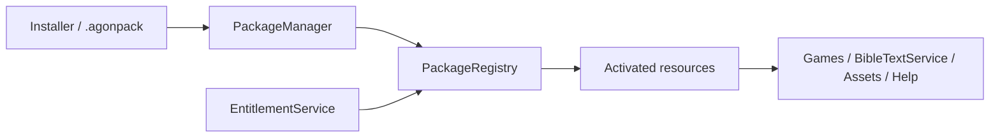

# Agon Package, Entitlement & Translation Development Guide

**Status:** STABLE target guide  
**Architecture:** `specs/architecture/packaging-installation-entitlements.md` (PR #424)

This guide explains how developers integrate games, content, translations, media and documentation with Agon's package/installation/entitlement architecture.

## Core rule

Do not couple a game to the desktop installer, product keys, filesystem package paths or a specific Bible publisher/provider. Games consume registries/services. Packaging and entitlement determine whether compatible resources are available.

## Package types

Normal `.agonpack` packages are declarative and non-executable. Supported foundational types are `GAME`, `CONTENT`, `BIBLE_TRANSLATION`, `MEDIA_ASSET`, `DOCUMENTATION`, and `BUNDLE`. Arbitrary executable scripts/modules are not permitted in ordinary packages. Trusted executable platform/modules ship through the signed Agon application/module release process.

## Manifest responsibilities

Every package declares a stable package ID, package version, manifest/schema version, Agon compatibility, dependencies/version ranges, resource/install class, integrity/signature metadata, provenance/licensing policy, entitlement ID when required, documentation contributions, assets, and permitted migrations.

Do not use display names as identifiers. Do not assume a package is usable merely because its files exist.

## Package state

Keep these questions separate:
1. Is it installed?
2. Is it compatible?
3. Is an entitlement required and satisfied?
4. Are dependencies/resources ready?

Typical states include `NOT_INSTALLED`, `INSTALLED_LOCKED`, `INSTALLED_AVAILABLE`, `INCOMPATIBLE`, `UPDATE_AVAILABLE`, `REPAIR_REQUIRED`, and `PINNED`.

Games must not implement licensing branches. They request a game/content/translation capability and receive availability/readiness through platform services.

## Bundled locked content

The standard installer may contain both included and locked packages. A locked package is installed and integrity-validated but not activated until EntitlementService reports the required entitlement. Unlocking it must not require reinstalling Agon when its dependencies are already present.

## Entitlements

Product keys are activation credentials, not direct unlock algorithms. Activation should produce a signed entitlement certificate. Agon validates certificates locally using trusted public keys; signing private keys never ship with the application.

Entitlements may represent included/free, purchased/key, site/organization, promotional/developer, time-limited/subscription, Hosted/account, or future license-permitted Event scopes. Business editions must not be hard-coded into games/packages.

Never log raw product keys, provider credentials, full entitlement certificates or private signing material.

## Offline behavior

A valid entitlement may authorize offline use according to its certificate/license policy. Activation-service outage must not disable unrelated Core/free Local play.

The architecture reserves a fully offline activation flow using an activation request and signed response file/code. Package installation from a local `.agonpack` file must likewise not require Internet access unless the package's actual content provider requires online access.

## Bible translation packages

`BIBLE_TRANSLATION` is first-class. Games always use `BibleTextService`.

Supported delivery models:
- local redistributable/offline translation;
- local entitlement-controlled translation;
- provider-backed translation whose API/caching behavior follows publisher/license policy.

Translation metadata declares translation identity, language, publisher/licensor, attribution/copyright, entitlement requirement, redistribution/caching/offline policy, canon/data version and capabilities such as verse text, search, exact-wording suitability, headings, notes, red-letter metadata, audio or cross references.

Never assume a Host's entitlement grants redistribution rights to another Shared installation. Remote-site readiness reports availability/entitlement/capability; protected text is transferred only when explicit license policy permits it.

## Package dependencies

Declare dependencies; do not reach into another package's physical directory. PackageManager resolves compatible versions and blocks unsafe installation/removal. Shared common assets/content should use stable registry IDs rather than duplicated copies.

## Saved sessions and Events

A saved session/Event may pin package, game definition, content revision and translation dependencies. Package updates/removals/cleanup must consult those pins. If compatibility/migration cannot be proven and a required version cannot coexist, the operation is blocked with an actionable explanation.

Do not change historical content/package data in place when a pinned session requires the prior revision.

## Updates

Application updates and package updates are separate. A compatible content/game/translation update should not require a new Agon executable.

Package/application update flow is acquire -> verify -> stage -> compatibility/migration preflight -> transactional install -> validate -> commit; failure rolls back. Never overwrite the only known-good copy before validation.

## Event preparation

`EventPreparationService` resolves required games, content revisions, translations, media/assets, documentation, endpoint capabilities, Shared compatibility and entitlements before play. Package authors must expose enough dependency/capability metadata for this to work without launching the game.

## Documentation requirements

A package contributes documentation through stable topic IDs and DocumentationRegistry. Game packages must satisfy How to Play/Quick Start requirements. Translation packages must provide attribution/license/availability guidance. Content/media packages should explain meaningful restrictions or dependencies. Do not point installed offline functionality exclusively at an external website.

## Security checklist

Package ingestion must validate schema/version, hashes/signatures, path safety, dependency graph and resource references before activation. Reject path traversal, executable payload attempts, malformed archives, unknown required schema semantics and tampered content. Treat downloaded and manually imported `.agonpack` files as untrusted input until validation succeeds.

## Testing checklist

For a package or package-related feature, cover applicable cases: valid install; dependency resolution; incompatible version; tampered/corrupt package; path traversal; locked-to-entitled transition; offline install; update rollback; saved-session pin; removal protection; documentation/assets resolution; registry rebuild; translation capability/readiness; and Shared protected-content boundary.

## Release checklist

Before publishing a package:
- manifest/schema validates;
- IDs/versions/dependencies are correct;
- Agon compatibility is explicit;
- integrity/signature metadata is produced;
- license/provenance/attribution reviewed;
- entitlement ID/policy correct;
- required documentation present;
- assets/content revisions resolve;
- migration/update path tested;
- saved-session compatibility considered;
- offline behavior documented;
- Shared/Hosted redistribution/capability policy explicit where relevant.

## Related issues

Implementation is tracked by #425–#436, with package manifest/store/entitlement/installer/translation/session-pin work in #425–#430 as P0 foundations.