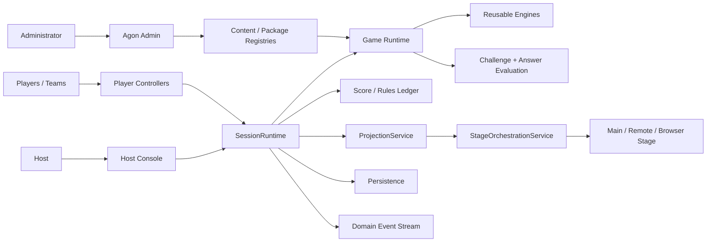
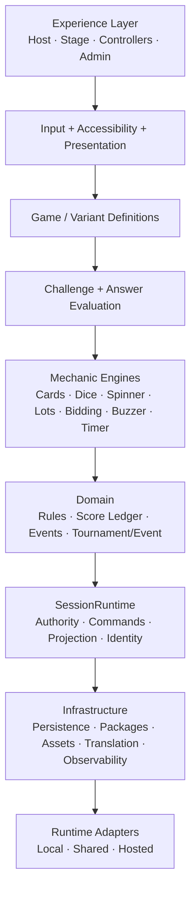
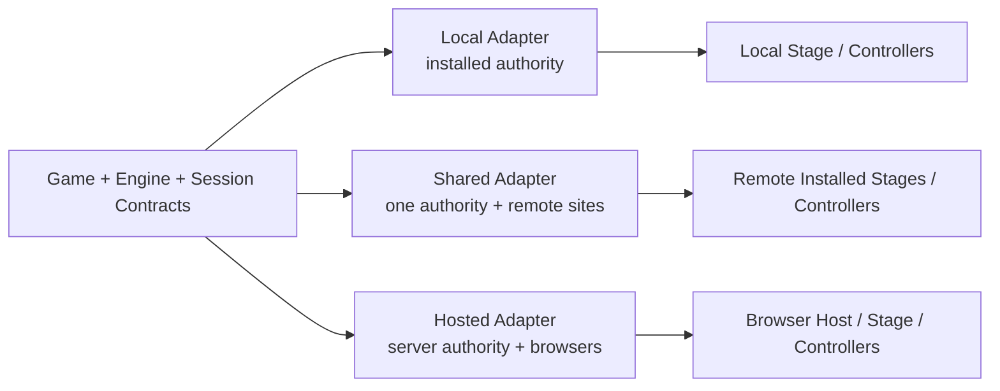
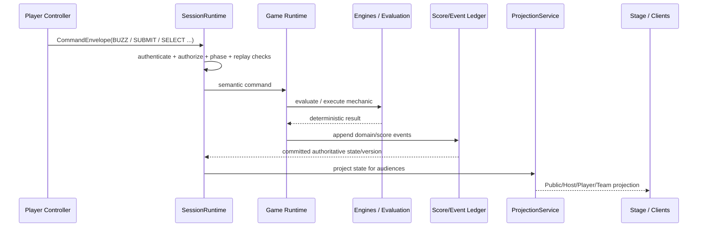
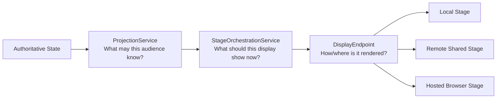
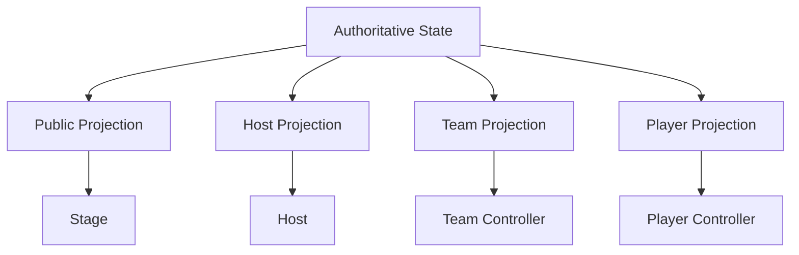
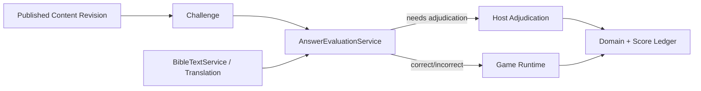

# Agon System Design

**Status:** STABLE architecture baseline  
**Scope:** Local, Shared and Hosted platform architecture; games and engines run above these contracts.

## 1. Goals

Agon is a Scripture-learning game platform whose games should remain portable across runtime modes and presentation surfaces. The architecture optimizes for:
- offline-first Local play;
- common game/engine code across Local, Shared and Hosted;
- up to four teams, with games allowed to impose lower participant limits;
- reusable mechanics/engines rather than one-off game implementations;
- deterministic authority for score, time, RNG, answers and tournament state;
- safe private/public projections;
- resumable Events and sessions;
- remote Stage orchestration without screen streaming;
- modular content/assets/translations to control binary size;
- testability through headless contracts and deterministic dependencies.

## 2. System context



Players and presentation surfaces never own authoritative gameplay state. They submit intent or render projections. `SessionRuntime` is the boundary through which authoritative mutation occurs.

## 3. Logical layers



### Dependency rule
Higher layers may depend on contracts exposed by lower layers. Lower layers do not import game-specific UI. Runtime-mode adapters do not contain game rules.

## 4. Canonical ownership

The canonical hierarchy is conceptually:

```text
Mechanic/Engine -> GameDefinition -> Variant -> Match/GameSession
                                         |
                                         +-> Tournament -> Event
```

- **Engine** owns reusable mechanics.
- **GameDefinition** composes engines/content/policies.
- **Variant** changes configuration/rules without cloning the game.
- **SessionRuntime** owns authoritative execution and command acceptance.
- **Tournament/Event** orchestrate matches and aggregate results; they do not reimplement games.
- **ScoreLedger** owns score mutations and corrections.
- **Persistence** stores authoritative snapshots/events/configuration; UI state is not the source of truth.

## 5. Runtime modes



### Local
The installed application is authority. Internet is not required for the baseline game experience. LAN controllers are clients of the Local authority.

### Shared
Exactly one session authority owns mutation. Remote installed sites connect through transport adapters, receive least-privilege projections and render Stage content locally. Shared does not stream the Host's screen.

### Hosted
A hosted authority implements the same `SessionRuntime` semantics. Browser clients use the same command/projection concepts.

## 6. Command and projection flow



No client response becomes authoritative merely because the client claims it happened. For competitive timing, authority/fairness policies determine acceptance/order.

## 7. Stage architecture

`ProjectionService` and `StageOrchestrationService` solve different problems:



Stage commands are semantic (`SHOW_SCOREBOARD`, `PRESENT_CHALLENGE`, `ANSWER_REVEAL`) rather than DOM/component manipulation. Synchronized reveals carry an intended authority time; each endpoint renders locally.

## 8. Data/privacy boundaries

Projection is allowlist-oriented. Hidden answers, private hands, unrevealed clues, maze paths and private simultaneous responses are not serialized to unauthorized audiences and hidden with CSS/JavaScript.



The same rule applies to logs/telemetry: credentials, private hands and unrevealed answers are not routine diagnostic payloads.

## 9. Timing and fairness

Mechanics declare network sensitivity:
- `TURN_BASED`
- `DEADLINE_BASED`
- `SIMULTANEOUS_PRIVATE`
- `FIRST_RESPONSE`
- `SYNCHRONIZED_PRESENTATION`

The authoritative clock owns deadlines/order. Network quality supplies RTT/jitter/offset uncertainty. A buzzer policy is bounded and auditable; it must not simply compute `arrivalTime - ping`. If uncertainty is too large, policy may declare first-response play unsuitable.

## 10. Persistence and deterministic recovery

A resumable session stores enough authoritative state to restore the same effective game:
- stable IDs and schema versions;
- resolved session configuration;
- selected game/variant/content revisions;
- score/rules ledger position;
- tournament/Event state;
- authoritative RNG state/seed where applicable;
- timer/deadline state;
- snapshot/event position;
- required package/translation dependencies.

Reconnect restores from authority. Clients do not upload their local state as truth.

## 11. Content and answer flow



Content has provenance/revision/review status. Context-scoped answer policies define aliases/normalization rather than games implementing arbitrary string matching.

## 12. Package and asset architecture

Games reference registry IDs rather than physical paths. Packages declare dependencies; resources may be `CORE_REQUIRED`, `INSTALLED`, `OPTIONAL`, `ON_DEMAND`, `EVENT_REQUIRED` or `CACHEABLE`. Saved sessions pin required versions. Package integrity and schema validation occur before activation.

## 13. Security/trust model

Untrusted inputs include controllers, browsers, remote sites, network messages, join tokens and imported packages. Authority validates session, actor, capability, phase, schema, ownership, idempotency/replay, state preconditions and limits before mutation.

Clients never authoritatively determine score, RNG, card draw, timeout, answer correctness or tournament advancement.

## 14. Availability and failure

Agon prefers explicit degraded states over silent inconsistency. Required dependencies are classified as `REQUIRED_AT_START`, `REQUIRED_CONTINUOUSLY`, `PREFETCHABLE` or `OPTIONAL`. Authority loss pauses/fails safely rather than allowing split brain. Remote Stage reconnect resynchronizes current presentation instead of replaying every missed animation.

## 15. Extension rules

A new game should normally be data/configuration over existing engines. Add a new engine only for a reusable mechanic. Add a novel code module only when the mechanic cannot reasonably be expressed through existing engines. Runtime-specific game forks (`GameLocal`, `GameHosted`) are prohibited unless an ADR establishes an exceptional reason.

## 16. Architectural validation gate

Before broad catalog migration, 2–3 representative reference games should prove the full path:

`GameDefinition -> Engines -> Content/Evaluation -> SessionRuntime -> Ledger/Persistence -> Projection -> Stage/Controllers`

Use those migrations to discover real gaps. After the foundation freeze, new cross-cutting abstractions require evidence from implementation or a concrete product requirement.