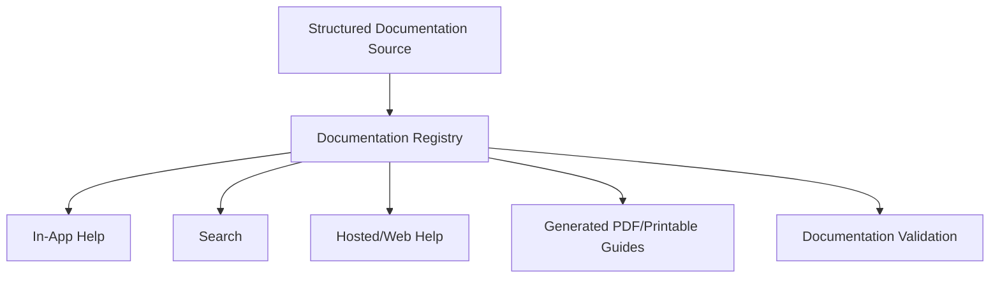

# Agon Documentation & Help System Architecture

## Purpose
Define documentation as a first-class Agon subsystem serving players, Hosts, administrators, parents/teachers, and developers across Local, Shared, and Hosted modes.

Documentation must remain useful offline, contextual to the current surface/game, versioned with games and platform capabilities, searchable, accessible, and capable of producing downloadable/printable guides without maintaining multiple conflicting sources.

## Principles
1. Structured documentation is the canonical source; in-app Help, web documentation and PDFs are delivery views.
2. Core Local help works without Internet access.
3. Every playable game has a How to Play entry and Quick Start before it is considered complete.
4. Help is context-sensitive: Game, Host, Stage, Controller and Admin surfaces open the most relevant topic.
5. Documentation travels with optional game/content packs when appropriate.
6. Documentation versions are compatible with the game/platform version they describe.
7. Player documentation is concise and task-oriented; administration/developer documentation can be deeper.
8. Parent/Teacher material supports Agon's Hear it -> Play it -> Say it -> Take it home learning model.
9. Documentation is accessible and localizable independently from Bible translation selection.
10. Contract/developer documentation remains documentation-as-code and changes with the contract.

---

# Audiences and document families

## Player Help
- joining a session
- Player Controller basics
- buzzing, text input, selection, ordering, cards/hands, bidding/pass/no-bid
- reconnect behavior
- accessibility controls
- game-specific How to Play
- concise troubleshooting

## Game How to Play
Every GameDefinition exposes documentation metadata/content including:
- one-line summary
- objective
- supported player/team count
- approximate duration where known
- setup
- turn/round flow
- controls/input actions
- scoring
- winning/completion condition
- difficulty/variant differences
- special rules
- examples where useful
- accessibility/input notes
- Host notes
- Quick Start/tutorial reference
- related Scripture/learning material where appropriate

Game help is versioned with the game definition/module. Installing an optional game pack installs its required player/Host help. Removing a pack may remove its help unless retained for a pinned saved session/archive policy.

## Host Guide
Task-oriented operating documentation distinct from full administration:
- create/start/resume sessions
- teams/players/controllers
- select/configure games
- Stage/projector setup
- run rounds
- pause/resume
- answer adjudication/corrections
- ties
- Events and tournaments
- disconnect/reconnect handling
- Shared/Hosted readiness
- common troubleshooting

## Administration Guide
- first run/install
- application policy/settings
- Events/templates
- tournament administration
- Bible translations/providers/licensing status
- content/game/media packs
- content authoring/review lifecycle
- accessibility defaults
- controllers/endpoints
- Stage/display endpoints
- Shared sites and Hosted administration
- identity/roles/capabilities where applicable
- backup/export/import/restore
- updates/releases/rollback
- diagnostics/logs
- security/privacy/data lifecycle
- troubleshooting/recovery

## Parent/Teacher Guide
For children's/learning-oriented games:
- learning objective
- Hear it passage/reference
- Play it explanation
- Say it memory verse
- Take it home / Dig Deeper card
- 2-3 discussion questions where authored
- age guidance
- related passages/topics

This content should reuse learning metadata/content rather than duplicate it in manually maintained prose whenever possible.

## Developer/Contributor Guide
Canonical repository documentation under `docs/development`:
- system design
- official contracts/API reference
- build/test/deploy
- ADRs
- creating a game
- creating an engine/mechanic
- content authoring/package development
- translation/provider integration
- Stage/display development
- testing/conformance/accessibility guidance
- release/migration/debugging guidance

---

# Canonical source and renderers

Conceptual flow:



PDF is a generated delivery artifact, not the canonical editable source.

Suggested generated publications:
- Agon Player Guide
- Agon Host Handbook
- Agon Administration Guide
- Agon Parent/Teacher Guide or game-specific learning sheets
- Agon Developer Guide

PDF generation can occur at release/build time. Local installs may bundle selected PDFs, expose a Save/Print action, or generate them from bundled documentation depending on packaging decisions.

---

# Documentation Registry

Define a runtime-neutral DocumentationRegistry.

Conceptual types:

```ts
type HelpAudience =
  | 'PLAYER'
  | 'HOST'
  | 'ADMIN'
  | 'PARENT_TEACHER'
  | 'DEVELOPER';

type HelpSurface =
  | 'MAIN_STAGE'
  | 'HOST_CONSOLE'
  | 'PLAYER_CONTROLLER'
  | 'ADMIN_CONSOLE'
  | 'WEB'
  | 'PRINT';

interface DocumentationTopic {
  topicId: string;
  version: string;
  titleKey: string;
  audience: HelpAudience[];
  surfaces: HelpSurface[];
  summary?: string;
  contentRef: string;
  keywords?: string[];
  relatedTopicIds?: string[];
  gameId?: string;
  featureId?: string;
  minAppVersion?: string;
  maxAppVersion?: string;
  locale?: string;
  offlineRequired?: boolean;
}
```

Registry responsibilities:
- resolve topic by ID/context
- enumerate installed help
- search metadata/content index
- select locale/fallback
- enforce version compatibility
- resolve related topics
- identify offline availability
- merge core + installed pack documentation

The Registry is content delivery only; it does not expose hidden game state.

---

# Context-sensitive Help

Every major UI surface exposes Help. A HelpContext describes the user's current location without leaking private game information.

```ts
interface HelpContext {
  surface: HelpSurface;
  routeOrView?: string;
  gameId?: string;
  gamePhase?: string;
  featureId?: string;
  role?: string;
  inputCapabilities?: string[];
}
```

Examples:
- Game screen -> How to Play current game
- Tournament setup -> Tournament formats
- Translation settings -> Bible translation/provider help
- Remote Stage setup -> Display endpoint help
- Controller join -> Joining/reconnecting
- Answer adjudication dialog -> Host adjudication guide

Context resolution returns a primary topic plus related topics. Help must not reveal unrevealed answers, private hands, or Host-only information to Player audiences.

---

# Quick Start and tutorials

Every game should provide a short Quick Start suitable for learning immediately before play. Target approximately 30-60 seconds of reading/presentation for ordinary games.

A future TutorialDefinition may provide interactive/simulated steps using semantic InputActions, but games are not required to implement an interactive tutorial initially. The documentation contract should reserve a tutorial reference now.

Quick Start should answer:
1. What am I trying to do?
2. What do I do on my turn/when prompted?
3. How do I score/win?
4. What unusual rule will surprise me?

---

# Search

Installed Local help is searchable offline. Search index includes:
- title
- summary
- keywords/synonyms
- game names
- feature names
- headings/content where practical
- audience/surface filters

Example queries:
- resume tournament
- connect phone
- Swiss tournament
- Wayfinder wrong answer
- Bible translation

Results identify category: Game Rules, Player, Host, Administration, Parent/Teacher, Troubleshooting, Developer where developer docs are exposed.

Hosted can provide server/web search but should preserve the same topic IDs and semantics.

---

# Offline, Shared and Hosted delivery

## Local
Core help and installed-game help are bundled/cached and require no Internet. External links are supplementary only.

## Shared
Each installed site has local documentation matching its installed version. The authoritative Host can reference a topic ID; a remote site resolves/render its compatible local topic. Documentation is not screen-streamed.

## Hosted
Browser help uses the same topic IDs/registry model and may be served from hosted static/content delivery. Version compatibility remains explicit.

---

# GameDefinition contract

Extend GameDefinition conceptually:

```yaml
documentation:
  howToPlayTopic: games.unveiled.how-to-play
  quickStartTopic: games.unveiled.quick-start
  hostTopic: games.unveiled.host
  parentTeacherTopic: null
  tutorialId: null
```

Validation for a publishable playable game requires at minimum:
- How to Play
- Quick Start
- scoring/winning documentation where applicable
- Host notes when Host behavior differs from ordinary platform behavior
- accessibility/input notes when special interaction is required

Kids games additionally require or explicitly waive Parent/Teacher learning material according to product policy.

---

# Documentation packages and manifests

Core documentation ships with Agon Core. Optional packages may contribute topics through package manifests.

Package validation checks:
- unique/stable topic IDs
- locale
- required topic references exist
- GameDefinition documentation references resolve
- compatible version range
- no unsafe paths/executable documentation payload
- asset references resolve
- links are valid where statically checkable

Documentation assets use Asset Registry logical IDs where appropriate.

---

# Localization and accessibility

Documentation localization uses application localization infrastructure, not Bible translation selection.

Requirements:
- semantic headings/lists/tables
- keyboard navigation
- screen-reader-compatible structure
- scalable text/reflow
- captions/transcripts for instructional media
- alt text for meaningful images/diagrams
- reduced-motion alternatives for animated tutorials
- printable high-contrast output where practical

Missing locale falls back deterministically and reports diagnostics.

---

# Documentation versioning

Topics have stable IDs and revisions/versions. A game/session may pin a documentation/game version when exact rules matter.

Rules:
- compatible clarification can update within compatible documentation revision
- rule-semantic changes accompany GameDefinition/game version changes
- historical/pinned saved sessions should be able to identify the rules version under which they were created
- obsolete topics can redirect to replacements while retaining historical identity where needed

Developer STABLE/LOCKED contract documentation follows the governance in `docs/development/README.md`.

---

# Documentation Definition of Done

## New game
Not complete until:
- GameDefinition documentation references validate
- How to Play exists
- Quick Start exists
- controls/input actions documented
- scoring/winning documented
- difficulty/variant differences documented
- Host-specific behavior documented
- accessibility/special interaction documented
- learning/Parent-Teacher material included when required

## New platform/Admin feature
Not complete until relevant contextual Host/Admin help exists and HelpContext mapping is registered.

## Contract/API change
Not complete until developer contract docs/types/schemas/tests are updated according to documentation-as-code governance.

## Breaking behavior change
Requires updated user/Host/Admin documentation and release/migration notes where applicable.

---

# Documentation testing

CI/conformance should eventually validate:
- GameDefinition help references resolve
- required topics exist
- no duplicate topic IDs
- locale fallback works
- internal links/topic references resolve
- referenced assets exist
- HelpContext mappings resolve
- Player topics cannot link directly to restricted Host/Admin-only content without authorization
- core offline topics are packaged
- PDF/static render succeeds
- basic accessibility linting
- docs version compatibility

Visual/tutorial screenshots should be updated/tested when UI changes materially.

---

# Developer documentation roadmap

Extend `docs/development` with:

```text
docs/development/
  README.md
  system-design.md
  contracts.md
  build-test-deploy.md
  guides/
    creating-a-game.md
    creating-an-engine.md
    creating-content.md
    creating-a-package.md
    translation-provider.md
    stage-display.md
  testing/
    conformance.md
    game-testing.md
    accessibility-testing.md
  adr/
```

Where practical, schemas/wire examples/compatibility matrices should be generated or verified against executable source definitions to prevent documentation drift.

---

# Initial implementation sequence

## P0 documentation contract
1. DocumentationRegistry/topic schema
2. HelpContext resolver contract
3. GameDefinition documentation metadata + validation
4. How to Play + Quick Start Definition of Done
5. core offline Help shell

## P1 product documentation
6. searchable Help Center
7. Host Guide
8. Administration Guide
9. Player Guide
10. Parent/Teacher guide integration
11. package-contributed documentation
12. localization/accessibility
13. generated PDF/print pipeline
14. documentation CI/conformance

## P1 developer documentation
15. Creating an Agon Game guide
16. engine/content/package/provider development guides
17. expanded testing/conformance guides
18. generated/verified API/schema reference

## P2
19. interactive tutorials
20. Hosted web documentation publishing
21. richer instructional media

# Definition of done
Agon has one versioned documentation model capable of serving contextual offline/in-app Help, package-specific game rules, Host/Admin/Parent-Teacher guidance, searchable help, web delivery and generated printable/PDF guides without maintaining separate conflicting sources.