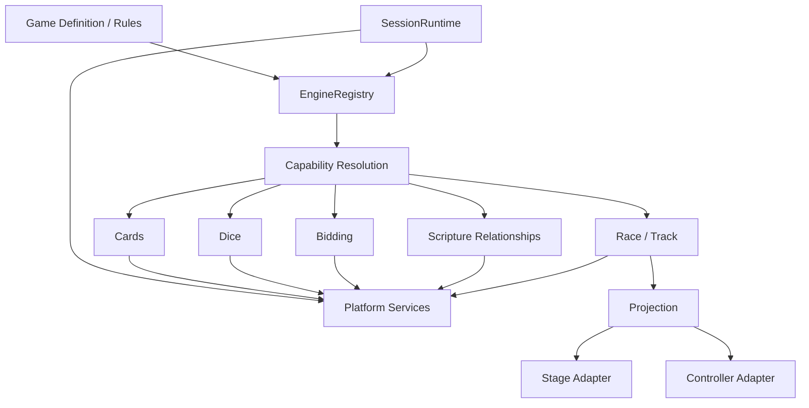

# Agon Engine SDK and Capability Registry

> **Status: design reference (merged 2026-09-28).** Implementation targets **Agon vNext** per [ADR-001](../../docs/architecture/adr-001-agon-vnext-staged-replacement.md) and [the vNext migration spec](../agon-vnext-migration-spec.md). Any integration through legacy `src/lib/gameEngine.ts`, `src/renderer/App.tsx`, per-game `PlayerStats` fields or the central `GameId` union described here is superseded. Sequencing is governed by `ROADMAP.md` and native GitHub issue dependencies. Where this document conflicts with ADR-001, **ADR-001 prevails**. Engine SDK P0 (#447–#450) is part of M0 (#509).

**Status:** Proposed STABLE foundation

## Goal
Adding a reusable engine must not require game-specific changes to SessionRuntime, persistence, networking, controllers, Stage routing, PackageManager, scoring, or installer logic. Games compose versioned capabilities; platform services discover and host engines through a common lifecycle.

## Principles
- Games depend on capability contracts, not concrete engine classes.
- Engines are generic domain mechanics, not Bible/game-specific rules.
- A game may compose zero, one, or many engines.
- Engines use injected platform services (RNG, clock, persistence context, event bus) rather than globals.
- Engine state is serializable/versioned when the engine declares persistence support.
- Commands/events/projections are explicit and privacy-aware.
- Stage/controller renderers are adapters over projections/actions, not engine internals.
- Engine capabilities/dependencies are declared in GameDefinition/package metadata and checked before play/Prepare Event.
- Engine versions follow compatibility rules; breaking contract changes require a new major capability version and migration/ADR.

## Architecture


## Descriptor and capability contract
```ts
interface EngineDescriptor {
  engineId: string;
  version: string;
  provides: EngineCapability[];
  requires?: CapabilityRequirement[];
  traits: EngineTrait[];
  stateSchemaVersion?: number;
}

type EngineTrait =
  | 'DETERMINISTIC'
  | 'SERIALIZABLE'
  | 'REPLAYABLE'
  | 'MULTIPLAYER'
  | 'STAGE_RENDERABLE'
  | 'CONTROLLER_INTERACTIVE'
  | 'AI_PLAYABLE';

interface CapabilityRequirement {
  capability: string;
  versionRange: string;
  optional?: boolean;
}
```

Capability IDs are stable names such as `cards.hand`, `dice.roll`, `bidding`, `scripture.relationship`, `race.track`. Games declare version ranges rather than importing concrete implementations.

## Lifecycle
```ts
interface EngineFactory<C, S, Cmd, Ev, P> {
  descriptor: EngineDescriptor;
  create(config: C, context: EngineContext): EngineInstance<S, Cmd, Ev, P>;
  restore(snapshot: EngineSnapshot<S>, context: EngineContext): EngineInstance<S, Cmd, Ev, P>;
}

interface EngineInstance<S, Cmd, Ev, P> {
  handleCommand(command: Cmd, actor: ActorContext): EngineTransition<S, Ev>;
  getProjection(viewer: ProjectionViewer): P;
  snapshot(): EngineSnapshot<S>;
  dispose(): void;
}
```

An engine may expose narrower typed APIs in addition to the common lifecycle, but SessionRuntime integrates through the standard lifecycle/descriptor.

## EngineContext
Injected context supplies deterministic RNG/clock where required, session/event identity, capability resolver, safe event publication, content/resource access interfaces and diagnostics. Engines do not instantiate networking, filesystem or global timers directly.

## Commands, events and authority
Commands express requested actions. The authoritative engine instance validates commands and emits state transitions/domain events. Events are immutable facts suitable for replay where the engine declares replayability. Idempotency/correlation metadata follows SessionRuntime contracts.

## Projections and privacy
Engine state is not automatically client-visible. `getProjection(viewer)` returns role/player-appropriate state. Private hands, hidden answers, unrevealed choices and other secrets remain absent from unauthorized projections. Projection leak tests are mandatory for engines with private state.

## Presentation adapters
`STAGE_RENDERABLE` does not mean an engine owns Stage. An engine publishes a stable presentation projection and optional renderer contribution/renderer ID. Stage selects the appropriate registered renderer. Controller UI consumes permitted actions/projection.

A new engine may add new renderer components, but must not require SessionRuntime or global Stage switch statements keyed to a specific game.

## Input actions
Controller interactions use semantic InputAction contracts. Engines register supported action descriptors; games decide which are enabled in a phase. Examples: `race.setPace`, `cards.select`, `bidding.submit`. Transport-specific key/button/touch mapping remains outside the engine.

## Composition
A game may require multiple capabilities:
```yaml
requires:
  - capability: race.track
    version: ^1
  - capability: challenge
    version: ^1
  - capability: scripture.relationship
    version: ^1
    optional: true
```
Game orchestration coordinates engine commands/events without one engine importing another concrete engine. Cross-engine workflows belong in game/orchestration rules or a reusable composition coordinator.

## Persistence/replay
Serializable engines expose versioned snapshots. Replayable engines emit deterministic domain events sufficient for reconstruction according to their contract. Saved sessions pin effective engine capability/version/schema requirements. Restore resolves a compatible engine or runs an explicit migration; it never silently substitutes incompatible semantics.

## Packaging and readiness
Engine implementations/trusted executable modules follow the signed application/module release path; normal `.agonpack` content remains non-executable. Game/package manifests declare engine capability requirements. PackageManager/Prepare Event resolves requirements before play and reports missing/incompatible capabilities with stable reason codes.

## Shared/Hosted
Wire protocols exchange engine capability IDs/versions and game-level commands/events/projections, not implementation objects. Shared sites negotiate compatible capabilities. Hosted authority may run engines server-side while browser clients render projections through the same logical contracts.

## Conformance kit
Every engine must pass applicable shared tests:
- descriptor/schema validation;
- capability/version resolution;
- deterministic same-seed behavior;
- command authorization/idempotency;
- snapshot/restore equivalence;
- replay equivalence;
- projection privacy;
- multiplayer actor isolation;
- invalid command safety;
- unknown/future schema rejection;
- renderer/action registration;
- package/readiness dependency reporting;
- Local/Shared/Hosted adapter compatibility where declared.

## Adding an engine
1. Define capability and version.
2. Implement descriptor/factory/instance.
3. Define commands/events/state/projections.
4. Register capability and presentation/input adapters.
5. Add persistence migration if needed.
6. Add package/readiness metadata.
7. Pass Engine SDK conformance tests.
8. Add developer documentation.
9. Games consume the capability; no SessionRuntime special case is added.

## Migration of existing engines
Existing Cards, Dice, Spinner/Wheel, Bidding, Maze/Wayfinder mechanics, Scripture Relationship and other reusable mechanics should be inventoried and progressively adapted to the SDK. Migration must preserve existing game behavior through compatibility adapters where practical; do not block all development on a big-bang rewrite.

## Non-goals
The Engine SDK is not a third-party arbitrary-code plugin system in its first version. It does not allow unsigned `.agonpack` files to execute code. It does not move game-specific rules into generic engines merely to maximize reuse.