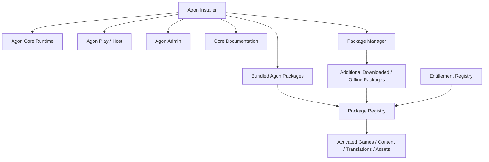
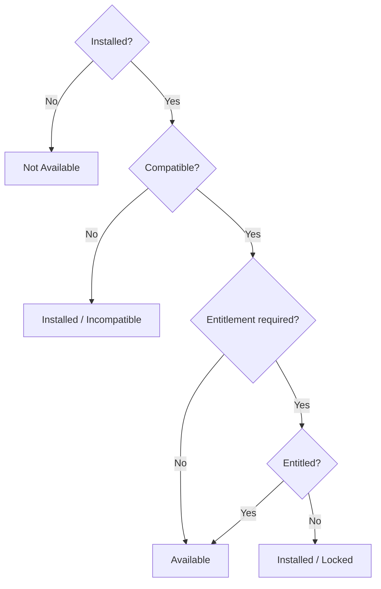
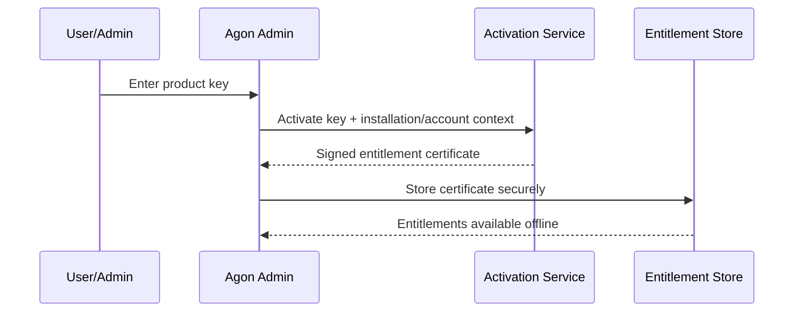
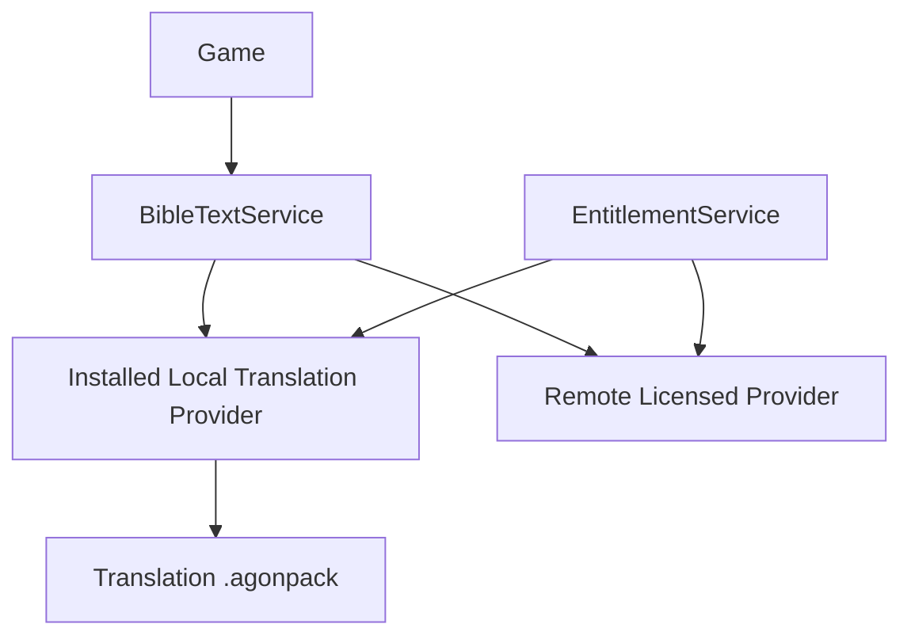
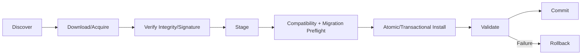

# Agon Packaging, Installation, Update & Entitlement Architecture

> **Status: design reference (merged 2026-09-28).** Implementation targets **Agon vNext** per [ADR-001](../../docs/architecture/adr-001-agon-vnext-staged-replacement.md) and [the vNext migration spec](../agon-vnext-migration-spec.md). Any integration through legacy `src/lib/gameEngine.ts`, `src/renderer/App.tsx`, per-game `PlayerStats` fields or the central `GameId` union described here is superseded. Sequencing is governed by `ROADMAP.md` and native GitHub issue dependencies.

## Purpose
Define packaging, installation, activation/entitlement, optional content delivery, Bible translation delivery, updating, repair, rollback, offline operation and Shared/Hosted compatibility as foundational Agon platform capabilities.

These contracts are required from the beginning so games/content/translations do not become coupled to the desktop installer or to a particular commercial licensing model.

## Goals
- One convenient installer can contain Agon Play, Agon Admin, Core and bundled content packs.
- Installed content and entitled content are separate concepts.
- Bundled-but-locked content can be unlocked without reinstalling.
- Additional games/content/media/translations can be downloaded later as packages.
- Local play remains offline-capable after installation/activation according to entitlement policy.
- Application updates and package updates are independent where compatibility permits.
- Saved Events/sessions cannot be silently broken by cleanup/update.
- Translation licensing/delivery can vary by publisher without changing game code.
- Shared sites negotiate compatibility and entitlements without assuming redistribution rights.
- Hosted uses the same logical package/entitlement contracts even when deployment is centralized.

---

# 1. Distribution model

Agon has two distinct layers of distribution.



The installer is a distribution convenience; `.agonpack` packages remain independently identifiable/versioned resources inside or outside that installer.

Initial distributions may include:
- `AgonSetup` — normal installer with Core/Admin/common content.
- future `AgonCompleteSetup` — optional large/offline distribution containing all redistributable packs.
- individual `.agonpack` files for later/offline installation.

The architecture does not require these exact product editions.

---

# 2. Application components

A normal desktop installation may install in one operation:
- Agon Core/runtime
- Agon Play/Host UI
- Agon Admin UI
- Local SessionRuntime/services
- Package Manager
- entitlement verification components
- core assets/documentation
- bundled packages

Play and Admin may share binaries/libraries while retaining the capability/module boundary defined by the Admin architecture.

The installer must not make individual games responsible for installation paths or registry state.

---

# 3. Package format

Use a versioned logical package format, provisionally `.agonpack`.

Package types include:
- `GAME`
- `CONTENT`
- `BIBLE_TRANSLATION`
- `MEDIA_ASSET`
- `DOCUMENTATION`
- `BUNDLE` (manifest/dependency grouping; no arbitrary code)
- future explicitly approved types

A package manifest conceptually includes:

```yaml
manifestVersion: 1
packageId: agon.games.example
packageType: GAME
version: 1.2.0
agonCompatibility:
  minVersion: 1.5.0
  maxVersion: null
dependencies:
  - packageId: agon.engine.cards
    versionRange: ">=1.0 <2.0"
capabilities: []
resources:
  installationClass: OPTIONAL
license:
  entitlementId: games.example
  redistributable: true
integrity:
  files: []
documentation:
  topicIds: []
migrations: []
```

Exact executable schema is versioned separately.

## Package rules
- stable globally unique package ID
- semantic/package version
- explicit Agon compatibility
- dependencies/version ranges
- resource/install classification (#406)
- integrity hashes/signature metadata (#395)
- licensing/provenance metadata
- documentation contributions (#413)
- assets through Asset Registry (#405)
- schema migrations where permitted
- deterministic install/activation validation

Normal data packages do **not** contain arbitrary executable code. Novel executable modules remain trusted/first-party code governed by the module architecture and application release/signing process unless a future security architecture explicitly changes this rule.

---

# 4. Installed vs compatible vs entitled vs active

These states must remain distinct.



PackageRegistry exposes state without requiring games to understand licensing.

A locked package may be physically present in a bundled installer. Entering/obtaining entitlement can activate it immediately without reinstall/download if all dependencies are present.

---

# 5. Entitlement architecture

Entitlements answer **who/what may use a capability/package**, independently of installation.

Conceptual API:

```ts
interface EntitlementService {
  getStatus(entitlementId: string, context: EntitlementContext): Promise<EntitlementStatus>;
  listEntitlements(context: EntitlementContext): Promise<Entitlement[]>;
  activate(request: ActivationRequest): Promise<ActivationResult>;
  importOfflineEntitlement(blob: Uint8Array): Promise<ActivationResult>;
}
```

Games must not validate product keys. They request capabilities/content through registries; registries use entitlement state.

## Entitlement sources
Architecture supports without hard-coding business editions:
- INCLUDED/FREE
- product/activation key
- purchased entitlement
- church/site entitlement
- promotional/granted entitlement
- developer/beta entitlement
- subscription/time-limited entitlement
- Hosted/account entitlement
- future Event-scoped entitlement if licensing permits

## Entitlement scope
An entitlement may be scoped by policy to:
- installation/device
- user/account
- household/organization/site
- Hosted tenant
- Event/session (future and only when permitted)

Commercial policy decides which scopes are offered; core runtime only understands the contract.

---

# 6. Product keys and signed entitlement certificates

A product key is an activation credential/identifier, not the long-term authorization mechanism.

Recommended flow:



A signed certificate can include:
- certificate/license ID
- entitlement IDs
- scope identifier/pseudonymous binding
- issued/not-before/expiry where applicable
- offline validity/refresh policy
- issuer/key ID
- signature
- schema version

Agon verifies certificates locally using embedded trusted public keys. Private signing keys never ship in the application.

Do not implement hard-coded `if key == ... unlock` behavior.

Desktop DRM cannot guarantee prevention of determined reverse engineering; design for reasonable integrity while minimizing burden on legitimate families/churches.

---

# 7. Offline activation and offline use

Offline-first Local play is a product requirement.

## Normal activation
Online activation obtains a signed certificate; thereafter locally authorized perpetual/offline entitlements validate without contacting a server every launch.

## Fully offline activation
Reserve a workflow:
1. Agon Admin creates an activation request file/code containing minimal installation request data.
2. User transfers it to an Internet-connected device/service.
3. Service returns signed entitlement response file/code.
4. User imports response in Admin.
5. Agon validates/stores entitlement locally.

No exact UX/provider is locked yet.

## Service outage
Previously valid offline entitlements continue according to their certificate policy. Activation-service outage must not disable unrelated free/core Local play.

---

# 8. Entitlement transfer, revoke and recovery

Architecture must support policies for:
- deactivate/transfer installation
- device replacement
- lost/reinstalled computer
- entitlement refresh
- revocation where legally/business-required
- perpetual entitlement
- subscription expiration/grace
- organization/site reassignment

Do not bind irrecoverably to volatile hardware identifiers. Use privacy-minimized installation identity and server-side recovery policy where online activation exists.

Entitlement credentials/certificates are not included in ordinary AgonArchive exports unless an explicit secure licensing design later permits it.

---

# 9. Bible translation packages

`BIBLE_TRANSLATION` is a first-class `.agonpack` type.

Games request Scripture from `BibleTextService`; they never load translation package files directly.



Translation manifest metadata includes:
- translation ID/abbreviation/full name
- language/locale
- publisher/licensor
- copyright/attribution text
- delivery model
- entitlement requirement
- redistributability/offline/caching policy
- text/data format version
- supported canon/books
- capabilities
- package/update version

## Translation delivery models
### A. Local redistributable pack
Complete permitted text is installed locally and works offline.

### B. Local entitlement-controlled pack
Text is installed/bundled/downloaded locally but activation requires an entitlement. Once valid, offline use follows license/certificate policy.

### C. Provider-backed translation
Pack/configuration installs provider metadata/adapter configuration while text is obtained through an authorized provider API. Caching/offline behavior is limited by provider/license policy.

A translation can move delivery models only through compatible migration/versioning and licensing review.

## Translation capabilities
Examples:
- verse text
- offline availability
- search
- exact-wording challenge suitability
- headings
- footnotes
- red-letter metadata
- audio
- cross references

Games declare requirements through existing translation/readiness contracts. Selecting a translation that lacks a required capability produces readiness guidance rather than game-specific failure.

## Licensing boundary
Host ownership does not imply the right to redistribute copyrighted Bible text to remote Shared sites. Shared/Hosted delivery follows each translation's license policy. Agon never silently copies a protected translation to another installation merely because the Host owns it.

---

# 10. Package Manager

Agon Admin exposes Package Management for:
- installed packages
- locked/unlocked state
- available updates
- dependencies
- disk footprint
- compatibility
- integrity/repair status
- license/entitlement status
- install from file
- download/install
- remove
- update
- repair

Conceptual package state:
`NOT_INSTALLED | DOWNLOADING | STAGED | INSTALLED_LOCKED | INSTALLED_AVAILABLE | INCOMPATIBLE | UPDATE_AVAILABLE | REPAIR_REQUIRED | PINNED`

Operations are transactional where practical.

---

# 11. Installation lifecycle

Desktop install sequence:
1. validate installer authenticity/integrity
2. preflight OS/disk/prerequisites
3. install Core/Play/Admin/package services
4. create application data/config locations with correct permissions
5. install bundled package payloads into package store
6. validate manifests/integrity/dependencies
7. initialize registries/database/schema
8. register shortcuts/protocol/file associations only where intentionally supported
9. first-run readiness
10. commit installation

User-created content, saved Events/sessions and optional learning history are application data, not replaceable program files.

Uninstall UX must distinguish removing application binaries/packages from deleting user data. Default should avoid silently deleting irreplaceable user-created/saved data.

---

# 12. Update lifecycle

Application and package updates are distinct.

## Application update
May update Core/runtime/Play/Admin/trusted executable modules/protocol/schema.

## Package update
May update game definitions/content/translations/media/docs without replacing Agon executable when compatibility permits.

Safe update pipeline:



Never mutate a package in place before validation/rollback data is available.

---

# 13. Saved-session/Event protection and version pinning

A saved session/Event records the effective versions/IDs necessary to resume safely, including game definition/module, content revision, translation dependency/policy, relevant package/schema versions and deterministic RNG/event state already defined elsewhere.

Package cleanup/update must check pins.

Possible result:
- update is compatible -> migrate/resume
- old package can coexist -> retain pinned version
- migration required -> validate before commit
- impossible -> block removal/update and explain dependency

Never silently delete a package/version required by a saved Event/session.

---

# 14. Event preparation

Add a `Prepare Event` capability.

Given an Event/tournament definition, dependency resolver computes:
- games/modules
- content revisions
- Bible translation(s)
- media/assets
- documentation
- controller/Stage capabilities
- Shared protocol/runtime compatibility
- entitlement requirements

Admin/Host sees readiness and can download/cache/install permitted missing dependencies before the gathering.

Example statuses:
- READY
- DOWNLOAD_REQUIRED
- PACKAGE_LOCKED
- LICENSE_REQUIRED
- INCOMPATIBLE
- REMOTE_SITE_MISSING_DEPENDENCY
- PROVIDER_ONLINE_REQUIRED

This extends the general Event readiness architecture.

---

# 15. Shared mode

Sites do not have to have byte-identical installations. They must satisfy negotiated requirements for the selected Event/session.

Handshake exchanges safe metadata:
- Agon protocol/runtime version
- required package IDs/compatible versions/capabilities
- selected translation capability/availability status
- required asset/content availability
- entitlement satisfaction status where relevant (not raw keys/certificates)

Authority does not send arbitrary executable modules to remote sites.

For redistributable packages, future Host-assisted package transfer may be supported only if package/license policy explicitly permits it. Protected translation/content must never be transferred merely because one site has entitlement.

An optional future Event-scoped entitlement model can temporarily authorize participants only if the relevant product/content license permits it; this is a business/licensing policy layered on the entitlement contract.

---

# 16. Hosted mode

Hosted uses the same logical PackageRegistry/EntitlementService/BibleTextService contracts but deployment can be centralized.

Hosted service controls installed/active package versions per environment/tenant. Browser clients receive only authorized projected content/assets, not raw server package stores or entitlement secrets.

Account/organization entitlement can map into EntitlementService. Hosted deployment may preinstall all packages while tenant entitlements determine activation.

---

# 17. Security

- Internet application/package distribution uses trusted signing/integrity verification.
- `.agonpack` validates hashes/schema/path safety before activation (#395).
- prevent zip-slip/path traversal and writes outside package store.
- package content cannot execute arbitrary scripts/code.
- entitlement certificate verification uses asymmetric signatures.
- private signing keys are never distributed with Agon.
- raw product keys are not routinely logged.
- entitlement certificates/tokens are treated as sensitive operational data.
- Admin capability required for install/remove/activation operations as policy dictates.
- downloads use secure transport; signature/integrity remains required independently.

---

# 18. Privacy

Activation collects only data needed by the licensing model. Avoid unnecessary personal/child data. Prefer installation/account/site identifiers over player identities.

Gameplay/learning data is not required merely to validate a package entitlement.

Telemetry must not contain raw product keys, provider API secrets or full entitlement certificates.

---

# 19. Repair and recovery

Admin/recovery tooling supports:
- verify application files
- verify package hashes
- rebuild PackageRegistry from manifests
- repair/reinstall package
- rollback failed update
- detect orphaned/staged packages
- safe cleanup of unreferenced cache
- recover interrupted installation/update
- diagnostics export without secrets
- safe mode using Core + known-good required packages where feasible

Package store should be reconstructable from package manifests plus persistence metadata; avoid a single opaque registry as the only source of truth.

---

# 20. Release channels

Architecture may support `STABLE`, `BETA`, `DEVELOPMENT`, but ordinary installations default to STABLE. Alternate channels require explicit Admin/developer selection and cannot silently convert a stable installation.

Package compatibility and entitlement are independent from release channel.

---

# 21. API boundaries

Conceptual services:

```ts
interface PackageManager {
  inspect(source: PackageSource): Promise<PackageInspection>;
  install(request: InstallRequest): Promise<InstallResult>;
  remove(request: RemoveRequest): Promise<RemoveResult>;
  update(request: UpdateRequest): Promise<UpdateResult>;
  repair(packageId: string): Promise<RepairResult>;
  resolve(requirements: PackageRequirement[]): Promise<ResolutionPlan>;
}

interface PackageRegistry {
  get(packageId: string): PackageState | undefined;
  list(filter?: PackageFilter): PackageState[];
  getCapabilityProviders(capability: string): PackageState[];
}

interface EntitlementService {
  getStatus(entitlementId: string, context: EntitlementContext): Promise<EntitlementStatus>;
  activate(request: ActivationRequest): Promise<ActivationResult>;
  importOfflineEntitlement(blob: Uint8Array): Promise<ActivationResult>;
}

interface EventPreparationService {
  analyze(eventId: string, sites?: SiteCapabilitySnapshot[]): Promise<EventPreparationReport>;
  prepare(plan: EventPreparationPlan): Promise<EventPreparationResult>;
}
```

These are STABLE target contracts; executable schemas/types may refine names while preserving responsibilities.

---

# 22. Documentation and UX

Admin Help must document:
- install/update/repair
- package states
- enter/activate key
- offline activation
- entitlement transfer/recovery
- install `.agonpack` from file
- Bible translation install/license behavior
- Event preparation
- rollback/troubleshooting

Locked content should be clearly distinguished from missing/incompatible content. Do not use error wording that implies a network failure when the actual state is `LICENSE_REQUIRED`.

---

# 23. Testing

Automated tests include:
- one installer registers Core/Admin/bundled packages
- bundled locked package unlocks without reinstall
- package dependency resolution/version conflict
- corrupted/tampered/signature failure
- path traversal rejection
- interrupted install/update recovery
- update rollback
- saved-session pin blocks unsafe removal
- package side-by-side/pinned version where supported
- product key activation -> signed entitlement -> offline verification
- expired/revoked/time-limited policy fixtures
- offline activation request/response
- entitlement service unavailable while valid offline entitlement continues
- local translation pack install/update/remove
- locked translation pack activation
- provider-backed translation outage/readiness
- Shared site incompatible/missing/unentitled translation
- no unauthorized translation redistribution
- Event Prepare resolves/downloads required dependencies
- uninstall preserves user data by default policy
- registry rebuild/repair

---

# 24. Sequencing

## P0 — before broad game/catalog migration and distribution
1. package manifest/schema + PackageRegistry contract
2. package store/install/remove/dependency resolver
3. entitlement model + local signed certificate verification
4. bundled locked-package activation path
5. `BIBLE_TRANSLATION` package contract integrated with BibleTextService
6. saved-session/package pin contract
7. installer layout for Core + Play + Admin + bundled packs
8. package integrity/path safety

## P1 — before external release / broader distribution
9. online activation service integration
10. offline activation workflow
11. package download/update/repair UI
12. safe app/package updater + rollback
13. Event Prepare
14. Shared package/capability/entitlement negotiation
15. translation package/provider management UI
16. recovery/repair tools
17. generated installation/licensing/admin documentation

## P2
18. Complete/offline installer distribution option
19. Host-assisted redistributable package transfer
20. Event-scoped entitlements where licensing/business policy permits
21. additional release channels
22. Hosted marketplace/catalog UX if ever desired

---

# Definition of done
- a single installer can install Agon Core, Play, Admin and bundled packages
- package installation and entitlement are independent
- bundled locked content can unlock without reinstall
- additional `.agonpack` packages can be installed later/from offline file
- normal packages cannot execute arbitrary code
- signed entitlements support offline validation
- Local core play remains usable without activation-service availability
- Bible translations are first-class packages/providers and games remain provider-agnostic
- protected translations are not implicitly redistributed in Shared mode
- app and package updates are independently versioned and rollback-safe
- saved sessions/Events protect required package/content versions
- Event Prepare verifies/downloads/caches permitted dependencies before play
- Admin can explain missing vs locked vs incompatible vs repair-required states
- package/entitlement secrets are protected and privacy-minimized
- repair/recovery exists for interrupted/corrupt installations
- Hosted/Shared can implement their deployment models without changing game logic